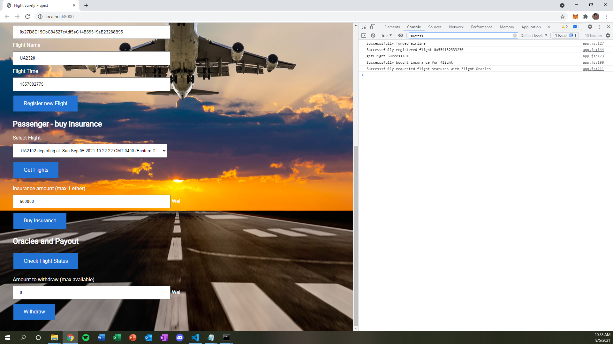
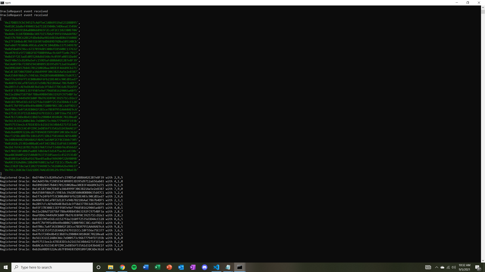
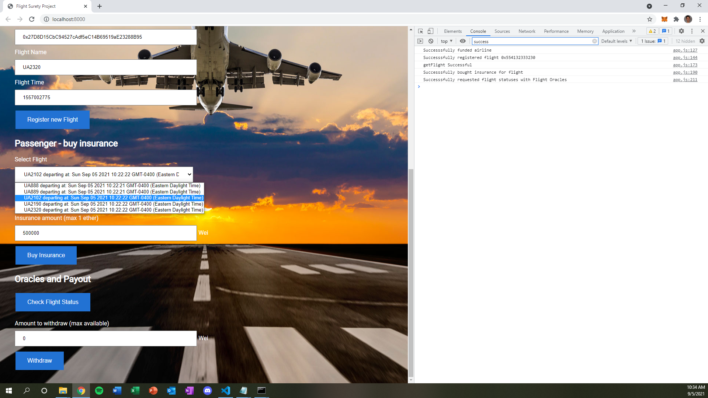
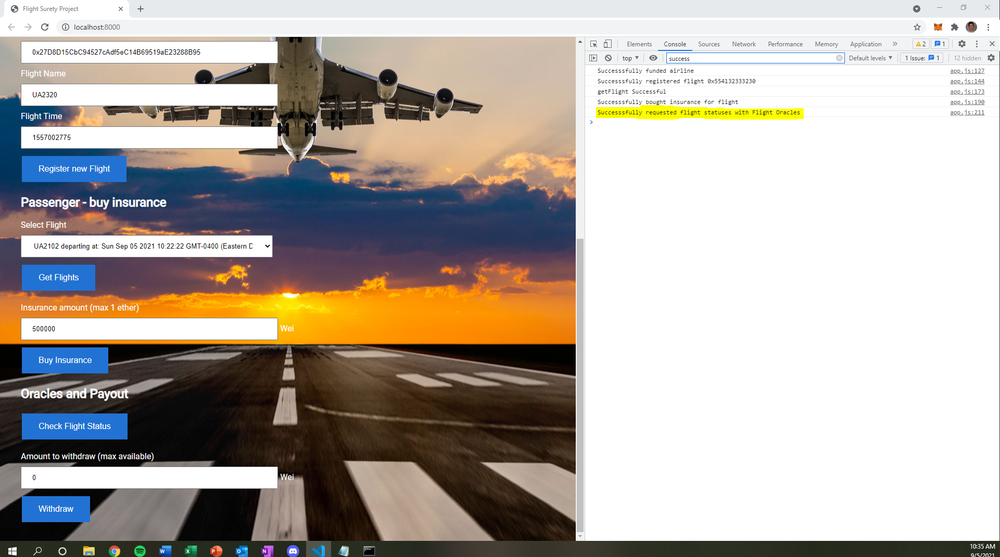

# FlightSurety

FlightSurety is a sample application project for Udacity's Blockchain course.

## Udacity Project Requirements

### Separation of Concerns, Operational Control and "Fail Fast"

* Smart Contract Separation *
* Contracts have been separated into FlightSuretyData.sol and FlightSuretyApp.sol
Dapp Created and Used for Contract Calls
* Follow instructions for "Run the Dapp" or see screenshots below

Oracle Server Application
* Follow instructions for "Develop Oracle Server" or see screenshots below

Operational Status Control Implemented
* Run truffle.cmd test to view "Separation of Concerns and Operational Control" test criteria passes
Fail Fast Contract
* "Require()" calls have been implemented in the beginning of each function body within each contract

### Airlines
Airline Contract Initialization
* First airline is registered with contract deployment
Multiparty Consensus
* Criteria: Airlines (Fund and Register Airlines)
* Run truffle.cmd test to view "Multi-party consensus: Allow the registration of the 5th and beyond airline through a voting process" test criteria passes
Airline Ante
* Run trufffle.cmd test to view "Only registered AND funded airlines should be able to register a flight" test criteria passes

### Passengers
Passenger Airline Choice
* See screenshot below or run the dapp

Passenger Payment
* Run trufffle.cmd test to view "Criteria: Airlines (Register Flights) and Passengers (Buy Insurance)" test criteria passes
Passenger Repayment && Passenger Withdraw && Insurance Payouts
* Run truffle.cmd test to view "Criteria: Oracle (Oracle Functions, Oracle Initialization, Updates) && Passengers (Passenger Repayment, Withdraw, and Insurance Payouts)" test criteria passes

### Oracles (Server App)
Functioning Oracle
* Run trufffle.cmd test to view oracle.js tests pass
Oracles Initialization
* Follow instructions for "Develop Oracle Server"

Oracle Updates
* Follow instructions for "Run the Dapp" or see screenshot below

Oracle Functionality
* Run trufffle.cmd test to view "Criteria: Oracle (Oracle Functions, Oracle Initialization, Updates) && Passengers (Passenger Repayment, Withdraw, and Insurance Payouts)" tests pass

## Install and Running the Dapp

This repository contains Smart Contract code in Solidity (using Truffle), tests (also using Truffle), dApp scaffolding (using HTML, CSS and JS) and server app scaffolding.

To install, download or clone the repo, then:

`npm install`
`truffle.cmd compile`

## Run truffle tests:

In the Command Prompt terminal run:
`ganache-cli -m "spirit supply whale amount human item harsh scare congress discover talent hamster" -e 500 -a 40 -l 10000000`

Then in a new Command Prompt terminal run:
`truffle.cmd test`

## Run the Dapp:

In the Command Prompt terminal run:

`ganache-cli -m "spirit supply whale amount human item harsh scare congress discover talent hamster" -e 500 -a 40 -l 10000000`

Then in a new Command Prompt terminal run:

`truffle.cmd migrate --network development`

`npm run dapp`

To view dapp:

`http://localhost:8000`

## Develop Oracle Server

`npm run server`

## Deploy

To build dapp for prod:
`npm run dapp:prod`

Deploy the contents of the ./dapp folder

## Resources

* [How does Ethereum work anyway?](https://medium.com/@preethikasireddy/how-does-ethereum-work-anyway-22d1df506369)
* [BIP39 Mnemonic Generator](https://iancoleman.io/bip39/)
* [Truffle Framework](http://truffleframework.com/)
* [Ganache Local Blockchain](http://truffleframework.com/ganache/)
* [Remix Solidity IDE](https://remix.ethereum.org/)
* [Solidity Language Reference](http://solidity.readthedocs.io/en/v0.4.24/)
* [Ethereum Blockchain Explorer](https://etherscan.io/)
* [Web3Js Reference](https://github.com/ethereum/wiki/wiki/JavaScript-API)
